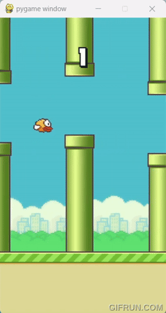
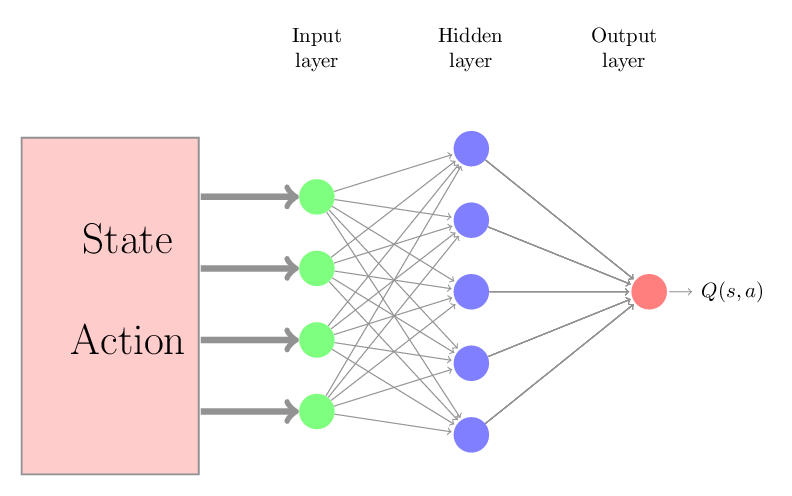
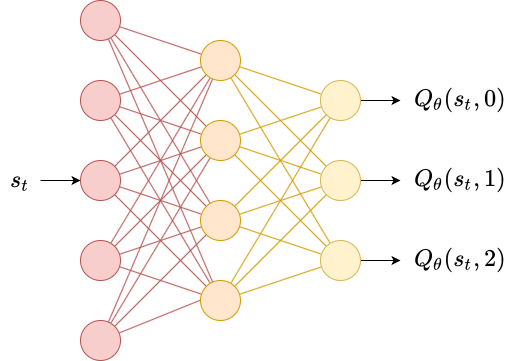

# Deep Q learning for Flappy Bird 🐤
This repository contains the implementation of a Deep Q Network (DQN) to play the Flappy Bird game. The DQN is a reinforcement learning algorithm that learns to play the game by interacting with the environment and updating its Q-values based on the observed rewards.Click [here](http://www.youtube.com/watch?v=9a1lPtSu9Fw) to see the full demo of the pre-trained agent achieving a score of 112

# Environment 🌳
### State Space 🌱
- the left most pipe's horizontal position
- the left most top pipe's vertical position
- the left most bottom pipe's vertical position
- the next pipe's horizontal position
- the next top pipe's vertical position
- the next bottom pipe's vertical position
- the next next pipe's horizontal position
- the next next top pipe's vertical position
- the next next bottom pipe's vertical position
- player's vertical position
- player's vertical velocity
- player's rotation
  
If the pipes have not appeared on screen yet, the values will be represented by 1 or 0
### Coordinates 🪴
- The leftmost screen position is considered 0, and the rightmost screen position is considered 1.
- The top of the screen is considered 0, while the bottom of the screen is considered 1.
- The horizontal position of a pipe is measured by its leftmost edge.
- The vertical position of the bird is measured by the bottom of the bird.
- The horizontal position of the bird's head is fixed at 0.30556 on the screen.
- The width of the bird is calculated as 25/230 of the screen width.
- The height of the bird is set to 0.06 of the screen height.
- The width of a pipe is defined as 1/6 of the screen width.
  
It's important to note that these values are not provided in the official documentation of the Flappy Bird Gym environment. Instead, they have been measured manually, pixel by pixel, to provide a reference for -crafting a new reward function. This is particularly crucial as the default reward function may prove challenging for training, and adjusting it based on these measurements can enhance the learning process. - Experimenting with these values allows for the creation of a more effective reward function tailored to the specifics of the Flappy Bird environment.
### Action space :shamrock:
0 - do nothing
1 - flap
### Rewards 🪙
- +0.1 - every frame it stays alive
- +1.0 - successfully passing a pipe
- -1.0 - dying
# Deep Q Network 🕸️
 
# Usage 📝
### Requirements ✅
- ##### Python 3.10.11
- ##### Jupyter Notebook
- ##### PyTorch
- ##### torchvision
- ##### matplotlib
### Run the Pre-Trained Agent :robot:
### Train You Own Agent :robot:

# Acknowledgements
[1] The original DQN research paper by Watkins https://link.springer.com/content/pdf/10.1007/BF00992698.pdf   
[2] UCLA RL course https://github.com/ucla-rlcourse
